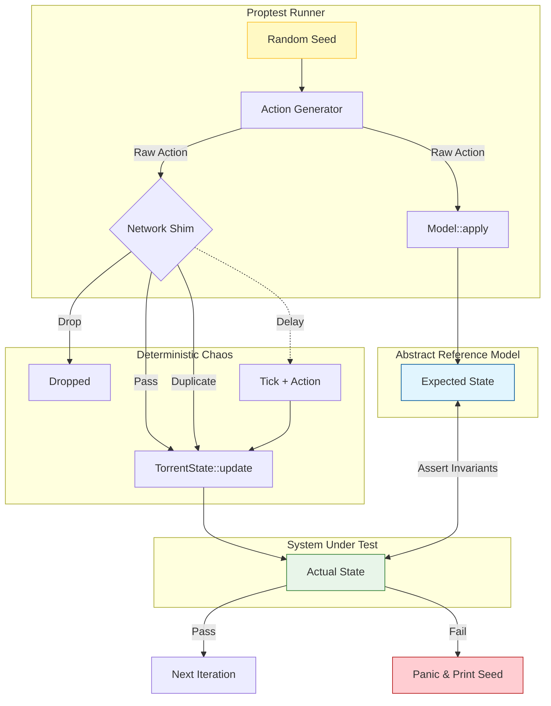

# superseedr - A Rust BitTorrent Client in your Terminal

[](https://github.com/Jagalite/superseedr/actions/workflows/rust.yml) [](https://github.com/Jagalite/superseedr/actions/workflows/nightly.yml) 

   [](https://ratatui.rs/)

superseedr is a modern Rust BitTorrent client featuring a high-performance terminal UI, real-time swarm observability, secure VPN-aware Docker setups, and zero manual network configuration. It is fast, privacy-oriented, and built for both desktop users and homelab/server workflows.


## 🚀 Features
- 🎨 Animated, high-performance TUI (1–60 FPS)
- 🧲 OS-level magnet link support
- 📊 Real-time network graphs and swarm analytics
- 🔐 Official Docker + VPN setup with automatic port forwarding
- 🔄 Dynamic inbound port reloading without restarting the client
- 🌐 Trackers, DHT, PEX, magnet links, private tracker support
- ⚡ Rust-based engine for performance and safety
- 💾 Persistent state with crash recovery
- 🧵 Peer-level metrics and availability heatmaps

## Installation

Download the latest release for your platform:
- Windows (.msi)
- macOS (.pkg)
- Debian (.deb)

👉 Available on the [releases page](https://github.com/Jagalite/superseedr/releases).

## Usage
Open up a terminal and run:
```bash
superseedr
```
> [!NOTE]  
> Add torrents by clicking magnet links in your browser or opening .torrent files.
> Optimal performance by increasing file descriptor limits: ulimit -n 65536

## ⚡ Quick Start
```bash
# Recommended (native install)
cargo install superseedr

# Docker (No VPN):
# Uses internal container storage. Data persists until the container is removed.
docker run -it jagatranvo/superseedr:latest

# Docker Compose (Gluetun with your VPN):
# Requires .env and .gluetun.env configuration (see below).
docker compose up -d && docker compose attach superseedr

```

## Running with Docker

superseedr offers a fully secured Docker setup using Gluetun. All BitTorrent traffic is routed through a VPN tunnel with dynamic port forwarding and zero manual network configuration.

If you want privacy and simplicity, Docker is the recommended way to run superseedr.

Follow steps below to create .env and .gluetun.env files to configure OpenVPN or WireGuard.

<details>
<summary><strong>Click to expand Docker Setup</strong></summary>

### Setup

1.  **Get the Docker configuration files:**
    You only need the Docker-related files to run the pre-built image, not the full source code.

    **Option A: Clone the repository (Simple)**
    This gets you everything, including the source code.
    ```bash
    git clone https://github.com/Jagalite/superseedr.git
    cd superseedr
    ```
    
    **Option B: Download only the necessary files (Minimal)**
    This is ideal if you just want to run the Docker image.
    ```bash
    mkdir superseedr
    cd superseedr

    # Download all compose and example config files
    curl -sL \
      -O https://raw.githubusercontent.com/Jagalite/superseedr/main/docker-compose.yml \
      -O https://raw.githubusercontent.com/Jagalite/superseedr/main/docker-compose.common.yml \
      -O https://raw.githubusercontent.com/Jagalite/superseedr/main/docker-compose.standalone.yml \
      -O https://raw.githubusercontent.com/Jagalite/superseedr/main/.env.example \
      -O https://raw.githubusercontent.com/Jagalite/superseedr/main/.gluetun.env.example

    # Note the example files might be hidden run the commands below to make a copy.
    cp .env.example .env
    cp .gluetun.env.example .gluetun.env
    ```

2.  **Recommended: Create your environment files:**
    * **App Paths & Build Choice:** Edit your `.env` file from the example. This file controls your data paths and which build to use.
        ```bash
        cp .env.example .env
        ```
        Edit `.env` to set your absolute host paths (e.g., `HOST_SUPERSEEDR_DATA_PATH=/my/path/data`). **This is important:** it maps the container's internal folders (like `/superseedr-data`) to real folders on your computer. This ensures your downloads and config files are saved safely on your host machine, so no data is lost when the container stops or is updated.

    * **VPN Config:** Edit your `.gluetun.env` file from the example.
        ```bash
        cp .gluetun.env.example .gluetun.env
        ```
        Edit `.gluetun.env` with your VPN provider, credentials, and server region.

#### Option 1: VPN with Gluetun (Recommended)

Gluetun provides:
- A VPN kill-switch
- Automatic port forwarding
- Dynamic port changes from your VPN provider

Many VPN providers frequently assign new inbound ports. Most BitTorrent clients must be restarted when this port changes, breaking connectability and slowing downloads.
superseedr can detect Gluetun’s updated port and reload the listener **live**, without a restart, preserving swarm performance.

1.  Make sure you have created and configured your `.gluetun.env` file.
2.  Run the stack using the default `docker-compose.yml` file:

```bash
docker compose up -d && docker compose attach superseedr
```
> [!TIP]
> To detach from the TUI without stopping the container, use the Docker key sequence: `Ctrl+P` followed by `Ctrl+Q`.
> **Optional:** press `[z]` first to enter power-saving mode.

---

#### Option 2: Standalone

This runs the client directly, exposing its port to your host. It's simpler but provides no VPN protection.

1.  Run using the `docker-compose.standalone.yml` file:

```bash
docker compose -f docker-compose.standalone.yml up -d && docker compose attach superseedr
```
> [!TIP]
> To detach from the TUI without stopping the container, use the Docker key sequence: `Ctrl+P` followed by `Ctrl+Q`.
> **Optional:** press `[z]` first to enter power-saving mode.

</details>

---

## 🛡️ Reliability & Correctness

`superseedr` is built on a foundation of **Model-Based Testing (MBT)** and **Deterministic Simulation**. Unlike legacy clients that rely on "testing in production," our core protocol engine is mathematically verified against an abstract reference model.

### The "Oracle" Pipeline
Every release is verified against a massive fuzzing suite that simulates **millions of state transitions** in minutes. This pipeline subjects the engine to deterministic network chaos to prove the absence of logic bugs before you ever run the app.

* **Property-Based Fuzzing:** We define an abstract "Oracle" that predicts exactly how the client *should* behave. The real engine is continuously fuzzed against this model to detect even the slightest state desynchronization.
* **Deterministic Chaos:** A custom network shim injects **packet loss**, **duplication**, and **reordering** (TCP/uTP simulation). If a crash occurs, the test suite prints a cryptographic seed, allowing us to replay the exact sequence of events instantly.
* **Adversarial Protocol Coverage:** We aggressively test hostile scenarios:
    * **Endgame Mode:** Verified deduplication when requesting the final blocks from multiple peers.
    * **Tit-for-Tat Evasion:** Handling malicious peers that "snub" us or send garbage data.
    * **Lifecycle Races:** Simultaneous Pause, Resume, and Delete commands while disk I/O is pending.

### Why This Matters
`superseedr` uses its fuzzing engine to proactively hunt down "impossible" bugs before release.
Every release is verified against a massive fuzzing suite, subjecting the engine to millions of deterministic state transitions under simulated network chaos (nightly fuzzing).

**Real-world bugs caught and fixed by our fuzzer include:**
* **Endgame Races:** Detected subtle data corruption when multiple peers sent the final missing piece simultaneously.
* **Lifecycle Deadlocks:** Fixed rare hangs that occurred when a user paused a torrent exactly while a disk write was flushing.
* **Arithmetic Overflows:** Identified edge cases in speed calculations that only occurred after days of continuous uptime.
* **Peer State Desync:** Prevented "ghost peers" where the client and the remote peer disagreed on which pieces were unchoked.

**Permanent Regression Testing**
When a failure is found, the **cryptographic seed is automatically saved to a regression file** checked into the repository. This guarantees that the exact random sequence that caused the crash is re-run on every future `cargo test`, ensuring the bug can never return.

<details>
<summary><strong>Deep Dive: The Testing Architecture (Mermaid)</strong></summary>


</details>


---

### Private Tracker Support 
`superseedr` fully supports private trackers. We offer specific builds (releases page) that strictly disable DHT and PEX to comply with private tracker rules while maintaining high-performance peering.

### Core Protocol & Peer Discovery
- **Real Time Performance Tuning:** Periodic resource optimizations (file handles) to maximize speeds and disk stability.
- **Peer Discovery:** Full support for Trackers, DHT, PEX, and Magnet Links (including metadata download).
- **Piece Selection:** Utilizes a Rarest-First strategy for optimal swarm health, switching to Endgame Mode for the final pieces.
- **Choking Algorithm:** Employs a tit-for-tat based choking algorithm with optimistic unchoking for efficient upload slot management.

### User Interface (TUI)
- **Real-time Dashboard:** A `ratatui`-based terminal UI displaying overall status, individual torrent progress, peer lists, and network graphs.
- **High Performance TUI:** FPS selector that allows 1-60fps.
- **Network Graph:** Historic time periods selector on network activity for network speed and disk failures.

### Configuration & Management
- **Persistent State:** Saves the torrent list, progress, and lifetime stats to a configuration file.
- **Speed Limits:** Allows setting global upload and download speed limits.

## Roadmap to V1.0
- **Testing:** Ongoing testing across various platforms and terminals.
- **Unit Testing:** Expansion of unit test coverage.
- **Atomic Config** Configs automatically saved to disk after any change.

## Future (V2.0 and Beyond)

### Refactors 
- **Codebase:** Reduce dependencies by implementing some of these features in the codebase.

### Networking & Protocol
- **Full IPv6 Support:** Allow connecting to IPv6 peers and announcing to IPv6 trackers, including parsing compact peers6 responses.
- **UPnP / NAT-PMP:** Automatically configure port forwarding on compatible routers to improve connectability.
- **Tracker Scraping:** Implement the ability to query trackers for seeder/leecher counts without doing a full announce (useful for displaying stats).
- **Network History:** Persisting network history to disk.
- **Crash Dump Ring Buffer:** Fully replayable crash dump of torrent state actions.

### Torrent & File Management
- **Selective File Downloading:** Allow users to choose which specific files inside a multi-file torrent they want to download.
- **Sequential Downloading:** Download pieces in order, primarily useful for streaming media files while they're downloading.
- **Torrent Prioritization / Queueing:** Allow users to set priorities for torrents and configure limits on the number of active downloading or seeding torrents.
- **Per-Torrent Settings:** Allow setting individual speed limits, ratio goals, or connection limits for specific torrents.
- **Torrent Log book:** Historic log book of all torrents added and deleted. Allows users to search and redownload.
- **Fully asynchronous validation:** Refactor for handling torrent validation and revalidations async.

### User Interface & Experience
- **Docker Detach Mode:** Allow for detached and attach sessions, TUI off mode.
- **Layout Edit Mode:** Allow the user to resize or drag and drop the layout of the panels.
- **RSS Feed Support:** Automatically monitor RSS feeds and download new torrents matching user-defined filters.
- **Advanced TUI Controls:** Add more interactive features to the TUI, like in-app configuration editing, more detailed peer/file views, advanced sorting/filtering.
- **TUI Files View Hierarchy:** Add a popup that shows in an interactive hierarchy view and live progress for the files of the torrent.
